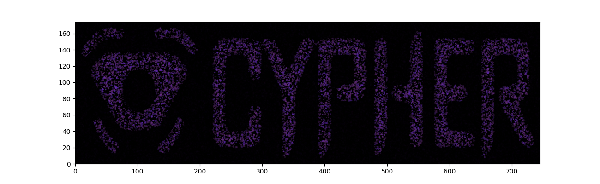
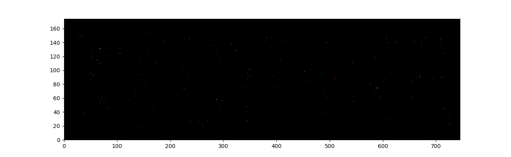
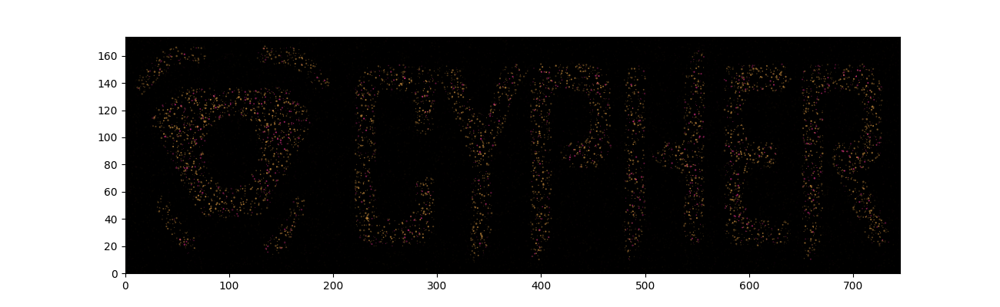
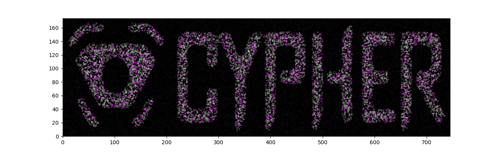

# Ethereum Address Image Generator

## Overview

This project is designed to generate images using provided masks and Ethereum addresses. It takes an Ethereum address as input and overlays it onto a provided mask image to create a customized image representation of the address.

## Features

- **Custom Image Generation**: Generate unique images based on Ethereum addresses and provided mask images.
- **Mask Overlay**: Overlay Ethereum addresses onto provided mask images to create visually appealing representations.

## Dependencies

- Python 3.8
- Pillow (Python Imaging Library)

## Usage

1. Clone the repository to your local machine:
   ```py
   python main.py --address 0x1234567890abcdef1234567890abcdef12345678 --mask mask.png
   ```

## Sample

Sample Image


1. Address: 0x1b6da3576908d78622cb96a3083a9e21307f962f



2. Address: 0x4b861f69074ac740eb569f4641f80be4258534be



3. Address: 0x55951a2444ec262d69642e12f883aebed9370c5a



4. Address: 0xc31d6db32bb4167b0c5abec04f84060351055e9c


